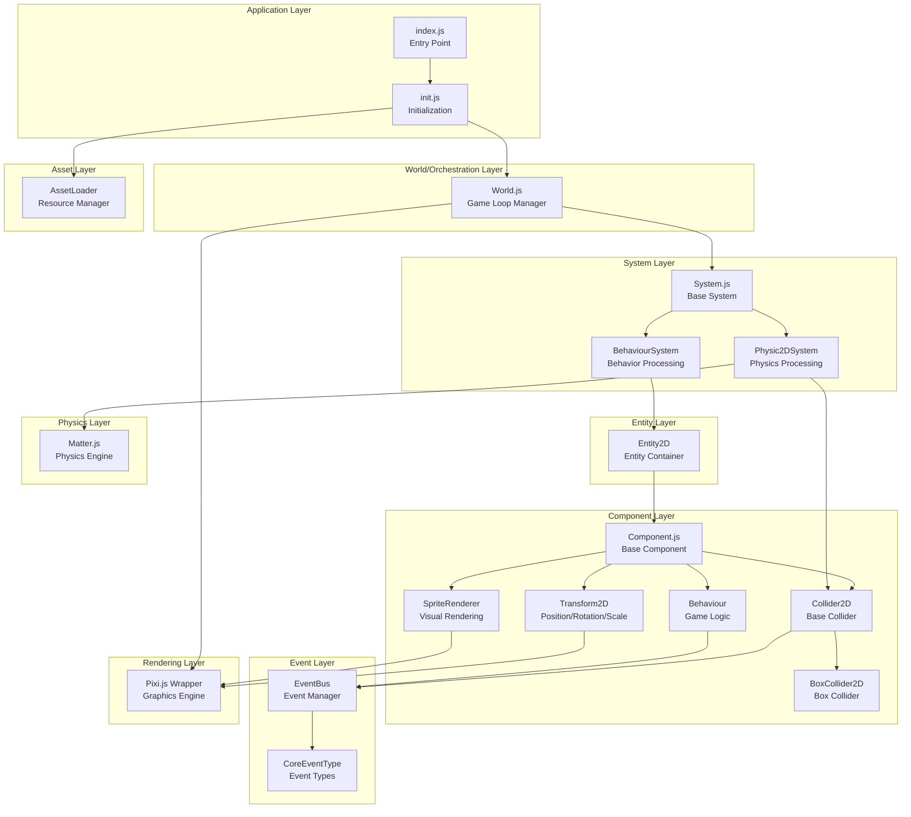

# Layer Diagram - Game Engine Backend Architecture

## Tổng quan kiến trúc

Game engine này được xây dựng theo mô hình **Entity-Component-System (ECS)** với các tầng backend được phân tách rõ ràng.

## Sơ đồ PlantUML (PlantText)

Đã tạo 2 file PlantUML để vẽ sơ đồ layer:

1. **LAYER_DIAGRAM.puml** - Sơ đồ class diagram style
2. **LAYER_DIAGRAM_COMPONENT.puml** - Sơ đồ component/layer view (khuyến nghị)

### Cách sử dụng:

1. Copy nội dung từ file `.puml` 
2. Paste vào [planttext.com](https://www.planttext.com)
3. Hoặc sử dụng plugin PlantUML trong IDE (VS Code, IntelliJ, etc.)

### Quick View - Component Diagram (Copy vào planttext.com):

Xem file `LAYER_DIAGRAM_COMPONENT.puml` để có sơ đồ layer rõ ràng nhất với 9 tầng được phân tách và tô màu.

## Sơ đồ các tầng (Layer Diagram - Mermaid)



## Mô tả chi tiết các tầng

### 1. **Application Layer** (Tầng Ứng dụng)
- **index.js**: Điểm vào chính của ứng dụng, khởi tạo game
- **init.js**: Khởi tạo asset loader và world

**Trách nhiệm:**
- Khởi tạo toàn bộ hệ thống
- Quản lý vòng đời ứng dụng

---

### 2. **World/Orchestration Layer** (Tầng Điều phối)
- **World.js**: Quản lý game loop, systems và entities

**Trách nhiệm:**
- Quản lý game loop (update/render)
- Điều phối các systems
- Quản lý vòng đời của entities
- Tích hợp với rendering engine (Pixi.js)

**Luồng hoạt động:**
```
init() → initSystems() → run() → update(dt) → render()
```

---

### 3. **System Layer** (Tầng Hệ thống)
- **System.js**: Base class cho tất cả systems
- **BehaviourSystem**: Xử lý logic game (behaviours)
- **Physic2DSystem**: Xử lý vật lý và va chạm

**Trách nhiệm:**
- Xử lý logic nghiệp vụ theo từng domain
- Cập nhật entities mỗi frame
- Quản lý lifecycle của components

**BehaviourSystem:**
- Quản lý queue của behaviours (thêm/xóa)
- Gọi `awake()`, `start()`, `update()` cho behaviours

**Physic2DSystem:**
- Tích hợp Matter.js engine
- Đồng bộ transform với physics body
- Xử lý collision events
- Debug rendering

---

### 4. **Entity Layer** (Tầng Thực thể)
- **Entity2D**: Container chứa các components

**Trách nhiệm:**
- Quản lý components (thêm/xóa/tìm)
- Quản lý trạng thái active/inactive
- Cung cấp lifecycle hooks cho components

**Cấu trúc:**
```javascript
Entity2D {
  components: Component[]
  behaviours: Behaviour[]
  transform: Transform2D
  container: Container
  renderer: Sprite
  activeSelf: boolean
}
```

---

### 5. **Component Layer** (Tầng Component)
- **Component.js**: Base class cho tất cả components
- **Transform2D**: Quản lý position, rotation, scale
- **SpriteRenderer**: Render sprite lên màn hình
- **Collider2D**: Base class cho colliders
- **BoxCollider2D**: Box-shaped collider
- **Behaviour**: Component cho game logic

**Trách nhiệm:**
- Mở rộng chức năng của entities
- Quản lý lifecycle (init, enable, disable, destroy)
- Tích hợp với systems tương ứng

**Component Lifecycle:**
```
create(entity) → init() → _onEnable() → [enabled] → _onDisable() → _onDestroy()
```

**Transform2D:**
- Đồng bộ với Pixi.js node (position, rotation, scale)
- Hỗ trợ parent-child hierarchy

**SpriteRenderer:**
- Tạo và quản lý Pixi.js Sprite
- Tự động thêm vào stage hoặc container

**Collider2D:**
- Tạo Matter.js body
- Đăng ký với Physic2DSystem
- Xử lý collision events

**Behaviour:**
- Đăng ký với BehaviourSystem
- Cung cấp hooks: awake(), start(), update()
- Xử lý input events (pointer events)
- Xử lý collision callbacks

---

### 6. **Event Layer** (Tầng Sự kiện)
- **EventBus**: Quản lý events toàn cục
- **CoreEventType**: Định nghĩa các loại events

**Trách nhiệm:**
- Decouple communication giữa các components
- Hỗ trợ system-level events và entity-level events
- Quản lý event listeners với context

**Event Types:**
- `ON_COLLISION_ENTER`: Khi collision bắt đầu

---

### 7. **Asset Layer** (Tầng Tài nguyên)
- **AssetLoader**: Quản lý loading và caching assets

**Trách nhiệm:**
- Load textures, sprites, sprite sheets
- Cache assets để tái sử dụng
- Hỗ trợ bulk loading
- Tích hợp với Pixi.js Assets API

**Asset Types:**
- Textures
- Sprite Sheets
- Models (planned)
- Spines (planned)
- Materials (planned)

---

### 8. **Rendering Layer** (Tầng Render)
- **Pixi.js Wrapper**: Wrapper cho Pixi.js v8

**Trách nhiệm:**
- Khởi tạo WebGL renderer
- Quản lý stage và scene graph
- Xử lý resize và scaling
- Render mỗi frame

**Tích hợp:**
- Hỗ trợ shared context với Three.js (optional)
- Responsive scaling logic

---

### 9. **Physics Layer** (Tầng Vật lý)
- **Matter.js**: Physics engine

**Trách nhiệm:**
- Mô phỏng vật lý 2D
- Xử lý collision detection
- Quản lý physics bodies
- Được điều khiển bởi Physic2DSystem

---

## Luồng dữ liệu (Data Flow)

### 1. **Khởi tạo (Initialization)**
```
index.js 
  → init() 
    → AssetLoader.loadAssets() 
    → World.init() 
      → Pixi.init() 
      → Systems.init()
```

### 2. **Game Loop**
```
World.run()
  → requestAnimationFrame loop
    → World.update(dt)
      → System.update(dt) (cho mỗi system)
        → BehaviourSystem: update behaviours
        → Physic2DSystem: update physics engine
    → World.render()
      → Pixi.render()
```

### 3. **Entity Creation**
```
new Entity2D()
  → entity.add(Component)
    → component.create(entity)
    → component.init()
      → Component-specific initialization
        → Transform2D: setup transform
        → SpriteRenderer: create sprite, add to stage
        → Collider2D: create body, register with Physic2DSystem
        → Behaviour: register with BehaviourSystem
```

### 4. **Event Flow**
```
Collision detected (Matter.js)
  → Physic2DSystem collision event
    → Collider2D.onCollisionEnter()
      → Entity.behaviours.forEach()
        → Behaviour.onCollisionEnter()
          → EventBus.emit() (optional)
```

---

## Mối quan hệ giữa các tầng

### Dependency Direction (Chiều phụ thuộc)
```
Application → World → Systems
Application → AssetLoader
World → Rendering (Pixi)
Systems → Entities → Components
Components → Systems (registration)
Components → EventBus
Components → Rendering (Pixi)
Physic2DSystem → Physics (Matter.js)
```

### Communication Patterns
1. **Direct Reference**: Components tham chiếu trực tiếp đến Systems để đăng ký
2. **Event Bus**: Components giao tiếp qua EventBus để decouple
3. **Entity Container**: Components truy cập nhau qua Entity
4. **System Processing**: Systems duyệt qua entities/components để xử lý

---

## Design Patterns được sử dụng

1. **Entity-Component-System (ECS)**: Core architecture pattern
2. **Observer Pattern**: EventBus cho event handling
3. **Strategy Pattern**: Các loại Systems khác nhau
4. **Template Method**: Component lifecycle methods
5. **Singleton**: World, EventBus, Systems instances

---

## Mở rộng trong tương lai

- Input System (xử lý input)
- Audio System (quản lý âm thanh)
- Animation System (xử lý animation)
- UI System (quản lý UI components)
- Scene Management (quản lý scenes)
- Save/Load System (lưu trữ game state)

